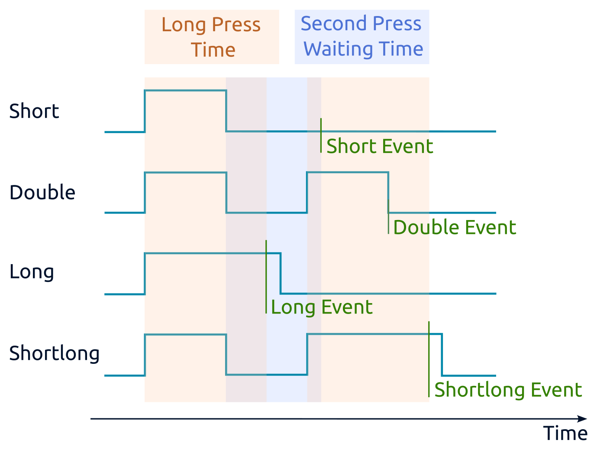
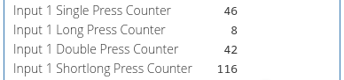

---
search:
  exclude: true
---

При выборе режима mapping-матрицы для кнопок, вы сможете настроить действия с выходами для каждого их четырёх типов нажатий, что позволит делать сценарные и проходные выключатели. Как это работает, смотрите в разделе _Распознавание типов нажатий_.

??? info "Диаграмма генерации событий"

    На диаграмме антидребезг отключён.

    

Доступны настройки:

- Время длинного нажатия (мс) — время в мс, которое разделяет длинные и короткие нажатия. Если нажатие длится больше указанного времени, оно считается длинным, иначе — коротким.
- Время ожидания второго нажатия (мс) — время в мс, которое создает «окно» указанной длительности после завершения короткого нажатия. Если второе нажатие попадет в это окно, нажатие будет считаться двойным, иначе — одиночным.
- Время подавления дребезга (мс) — время в мс, в течение которого сигнал на входном клеммнике должен иметь неизменный уровень, после чего он будет зафиксирован и обработан алгоритмом распознавания нажатий. При работе с нажатиями, значение должно быть в 5-10 раз меньше, чем время ожидания второго нажатия.
- Период опроса для каждого счётчика — чтобы обрабатывать нажатия программно на контроллере, включите опрос нужных счётчиков и настройте период опроса по инструкции.

??? info "Счётчики нажатий в карточке устройства в веб-интерфейсе контроллера"

    

Детектирование двойных вносит задержку на детектирование одиночных. Например, при настройке по умолчанию (300 мс) событие одиночного нажатия произойдет через 300 мс после отпускания кнопки. Если вам не нужны двойные и короткие, а затем длинные нажатия, то Время ожидания двойного нажатия нужно установить на 0 мс. Тогда событие одиночного нажатия произойдет сразу после отпускания кнопки.

Распознавание нажатий выполняется после подавления дребезга. Это означает, что при настройке Время подавления дребезга по умолчанию (50 мс) любые нажатия длительностью менее 50 мс будут игнорироваться. Точно так же это влияет на скорость реакции при отпускании кнопки: отпускание будет зафиксировано через 50 мс после фактического отпускания кнопки. Время подавления дребезга следует подбирать к конкретной кнопке таким образом, чтобы вносимая задержка была минимальной, но не было ложных срабатываний, например, двойное нажатие вместо одиночного.

Настройки входов по умолчанию:

- каждый вход управляет соответствующим реле, т.е. вход номер 2 управляет реле номер 2;
- режим работы для входов — выключатель с фиксацией.

??? info "Видео: Обработка нажатий в устройствах Wiren Board"

    
