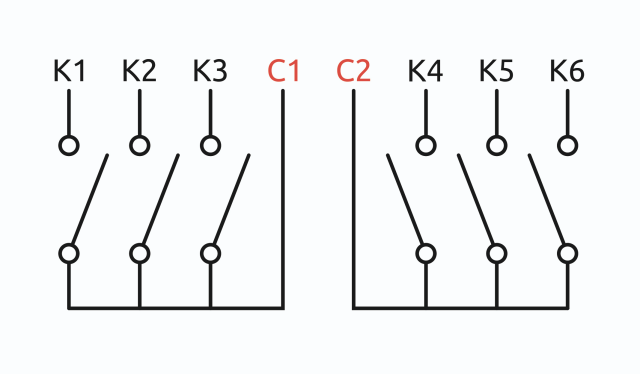

# Модуль реле WB-MR6C v.2

{ width="300" align=right}

## Описание

Шестиканальные модули реле WB-MR6C v.2 выпускаются для систем промышленной и домашней автоматизации и предназначены для прямого управления светодиодными, люминесцентными светильниками, лампами накаливания и другими нагрузками номиналом до 10 А (2 кВт). Также могут использоваться как модули ввода-вывода общего назначения.

Благодаря специальной конструкции реле, каждый канал может выдерживать длительный ток до 16 А и пусковые токи до 80 А. Обратите внимание, что из-за конструкции клеммников, суммарный номинальный коммутируемый ток на группу из трёх каналов 20 А.

??? note "Технические характеристики"

    Питание

    | Параметр                                                                       | Значение                                                                                                                                                                                                                                                             |
    |--------------------------------------------------------------------------------|----------------------------------------------------------------------------------------------------------------------------------------------------------------------------------------------------------------------------------------------------------------------|
    | Напряжение питания                                                             | 9 – 28 В постоянного тока                                                                                                                                                                                                                                            |
    | Потребляемая мощность                                                          |   В режиме холостого хода (со всеми выключенными реле) — 0.1 Вт   Со всеми включенными реле — 1 Вт   Пиковое значение — до 4 Вт в течение 20 мс                                                                                                                      |

    Выходы

    | Параметр                                                                       | Значение                                                                                                                                                                                                                                                             |
    |--------------------------------------------------------------------------------|----------------------------------------------------------------------------------------------------------------------------------------------------------------------------------------------------------------------------------------------------------------------|
    | Количество выходов                                                             | 6                                                                                                                                                                                                                                                                    |
    | Тип выходов                                                                    | Контакты механического реле                                                                                                                                                                                                                                          |
    | Конфигурация контактов                                                         | Двухпозиционные, нормально открытые                                                                                                                                                                                                                                  |
    | Конфигурация выходов                                                           | Две группы по 3 выхода, общий провод в каждой группе                                                                                                                                                                                                                 |
    | Максимальное коммутируемое напряжение, AC                                      | 250 В                                                                                                                                                                                                                                                                |
    | Максимальное коммутируемое напряжение, DC                                      | 30 В                                                                                                                                                                                                                                                                 |
    | Номинальный коммутируемый ток на каждый канал, 230 В (AC)                      | 10 А                                                                                                                                                                                                                                                                 |
    | Максимальный коммутируемый ток на каждый канал, 230 В (AC)                     | 16 А                                                                                                                                                                                                                                                                 |
    | Максимальный пусковой ток (в течение 20 мс), 230 В (AC)                        | 80 А                                                                                                                                                                                                                                                                 |
    | Суммарный номинальный коммутируемый ток на группу из трёх каналов, 230 В (AC)  | 20 А                                                                                                                                                                                                                                                                 |
    | Сопротивление контактов                                                        | < 100 мОм                                                                                                                                                                                                                                                            |
    | Напряжение изоляции между контроллером и выходом                               | 1500 В (среднеквадратичное значение)                                                                                                                                                                                                                                 |
    | Срок жизни                                                                     | 100 000 переключений для нагрузки 10 А / 230 В переменного тока                                                                                                                                                                                                      |
    | Подробные характеристики                                                       | Hongfa HF32FV-16                                                                                                                                                                                                                                                     |

    Входы

    | Параметр                                                                       | Значение                                                                                                                                                                                                                                                             |
    |--------------------------------------------------------------------------------|----------------------------------------------------------------------------------------------------------------------------------------------------------------------------------------------------------------------------------------------------------------------|
    | Количество входов (Inputs 0—6)                                                 | 7 (6+1) Вход 0 отключает одновременно все реле (можно настроить по-другому)                                                                                                                                                                                          |
    | Тип входов                                                                     | «Сухой контакт», групповая изоляция  Напряжение на входе ~12 В.  Ток при замыкании входа ~2 мА                                                                                                                                                                       |
    | Допустимое напряжение                                                          | от -20 В до +40 В                                                                                                                                                                                                                                                    |
    | Частота и длительность импульсов                                               |   До 10 Гц (T > 50 мс) - по умолчанию   До 1 кГц при уменьшении времени защиты от дребезга   До 5 кГц (с версии прошивки 1.15.0)   (смотри таблицу ревизий)                                                                                                          |
    | Функции                                                                        |   Входы общего назначения   Счет сигналов   Измерение частоты (с версии прошивки 1.15.0)   Прямое управление каналами реле   Одновременное отключение всей нагрузки   Гибкая настройка взаимодействия с реле   с помощью mapping-матрицы (с версии прошивки 1.9.0)   |

    Индикация

    | Параметр                                                                       | Значение                                                                                                                                                                                                                                                             |
    |--------------------------------------------------------------------------------|----------------------------------------------------------------------------------------------------------------------------------------------------------------------------------------------------------------------------------------------------------------------|
    | Индикация питания и обмена данными                                             | Зеленый светодиод Status (под верхней этикеткой)                                                                                                                                                                                                                     |
    | Индикация состояния каналов реле                                               | Оранжевые светодиоды 1, 2.. (под верхней этикеткой)                                                                                                                                                                                                                  |

    Управление

    | Параметр                                                                       | Значение                                                                                                                                                                                                                                                             |
    |--------------------------------------------------------------------------------|----------------------------------------------------------------------------------------------------------------------------------------------------------------------------------------------------------------------------------------------------------------------|
    | Интерфейс управления                                                           | RS-485                                                                                                                                                                                                                                                               |
    | Изоляция интерфейса                                                            | Неизолированный                                                                                                                                                                                                                                                      |
    | Протокол обмена данными                                                        | Modbus RTU, адрес задается программно, заводские настройки указаны на наклейке                                                                                                                                                                                       |
    | Параметры интерфейса RS-485                                                    | Задаются программно, по умолчанию:  скорость — 9600 бит/с; данные — 8 бит; бит чётности — нет (N); стоп-биты — 2                                                                                                                                                     |
    | Готовность к работе после подачи питания                                       | ~2 c                                                                                                                                                                                                                                                                 |

    Условия эксплуатации

    | Параметр                                                                       | Значение                                                                                                                                                                                                                                                             |
    |--------------------------------------------------------------------------------|----------------------------------------------------------------------------------------------------------------------------------------------------------------------------------------------------------------------------------------------------------------------|
    | Температура воздуха                                                            | От −40 до +80 °С                                                                                                                                                                                                                                                     |
    | Относительная влажность                                                        | До 95 %, без конденсации влаги                                                                                                                                                                                                                                       |
    | Климатическое исполнение по ГОСТ 15150-69                                      |  O2.1*                                                                                                                                                                                                                                                               |
    | Гарантийный срок                                                               | 2 года                                                                                                                                                                                                                                                               |
    | Срок службы                                                                    | 5 лет                                                                                                                                                                                                                                                                |

    Клеммники и сечение проводов

    | Параметр                                                                       | Значение                                                                                                                                                                                                                                                             |
    |--------------------------------------------------------------------------------|----------------------------------------------------------------------------------------------------------------------------------------------------------------------------------------------------------------------------------------------------------------------|
    | Рекомендуемое сечение провода с НШВИ                                           | для входов управления: 0.35 – 1 мм2 — одинарные, 0.35 – 0.5 мм2 — сдвоенные провода,  для силовых входов:  до 2.5 мм2 — одинарные, до 1.5 мм2 — сдвоенные провода                                                                                                    |
    | Длина стандартной втулки НШВИ                                                  | 8 мм                                                                                                                                                                                                                                                                 |
    | Момент затяжки винтов                                                          | для входов управления: 0.2 Н∙м, для силовых выходов: 0.5 Н∙м                                                                                                                                                                                                         |

    Габариты

    | Параметр                                                                       | Значение                                                                                                                                                                                                                                                             |
    |--------------------------------------------------------------------------------|----------------------------------------------------------------------------------------------------------------------------------------------------------------------------------------------------------------------------------------------------------------------|
    | Ширина, DIN-юнитов                                                             | 3                                                                                                                                                                                                                                                                    |
    | Габаритные размеры (Д x Ш x В)                                                 | 53 x 90 x 58 мм                                                                                                                                                                                                                                                      |
    | Масса (с коробкой)                                                             | 155 г                                                                                                                                                                                                                                                                |

## Общий принцип работы

### Индикация

В модуле есть индикаторы, которые помогут определить его состояние без подключения к контроллеру:

- S — статус обмена по Modbus: загорается при подаче низковольтного питания на модуль и мигает в момент опроса по шине RS-485. В режиме загрузчика редко мигает. При загрузке новой прошивки перестает менять свое состояние.
- 1–6 — состояние выходов: горит — реле замкнуто.

### Входы

Входы реле выведены на разъёмные клеммники с номерами и общей клеммой iGND, работают по принципу «Сухой контакт».

=== "fw ≥ 1.15.0"

    К входам можно подключить выключатели для прямого управления выходами, или источник сигнала и посчитать количество импульсов, а также измерить его частоту.

    Максимальное значение измеряемой частоты сигнала зависит от ревизии устройства и от количества измеряемых сигналов. На испытании мы успешно измеряли шесть сигналов одновременно на частоте 2.5 кГц.

=== "fw < 1.15.0"

    К входам можно подключить выключатели для прямого управления выходами, или источник сигнала и посчитать количество импульсов.

    Выключатели можно использовать с фиксацией и без неё. При использовании выключателей без фиксации доступно распознавание нескольких типов нажатий, на которые можно назначить свои действия — это полезно для создания сценарных выключателей.

    Также эти нажатия транслируются на контроллер по Modbus, где вы можете обрабатывать их программно. В ПО контроллера Wiren Board счётчики нажатий по умолчанию не опрашиваются, если они вам нужны — включите их опрос в настройках устройства.

По умолчанию каждый вход управляет выходом с таким же номером, а вход с номером «0» отключает все выходы.

=== "fw ≥ 1.12.0"

    По умолчанию модуль настроен на выключатели с фиксацией — состояние контактов реле повторяют состояние контактов выключателя.

=== "fw < 1.12.0"

    По умолчанию модуль настроен на работу с выключателями без фиксации — каждое замыкание входа меняло состояние реле на противоположное.

Тип выключателей и настройки входов можно изменить в настройках.

### Распознавание типов нажатий

=== "fw ≥ 1.17.0"

    Модуль может распознавать четыре типа нажатий: короткое, длинное, двойное, короткое, а затем длинное.

    Обработку нажатий можно использовать на контроллере, куда по Modbus передаются специальные счётчики для каждого типа нажатий, или в самом устройстве для управления выходами.

    Параметры распознавания нажатий можно изменять в настройках.

=== "fw < 1.17.0"

    Не поддерживается.

### Выходы

Внутри установлены 6 реле Hongfa HF32FV-16 с нормально открытыми контактами. Выходы объединены в две группы, каждая со своим общим проводом: COM1 и COM2. На выходы COM1 и COM2 можно подключить разные фазы. Допустимую мощность и тип коммутируемой нагрузки смотреть в статье Рекомендации по выбору реле.

<figure markdown>
  { width="300" }
  <figcaption>Контакты реле WB-MR6C</figcaption>
</figure>

С прошивки 1.18.4 можно настроить безопасное состояние каждого выхода выбрать поведение выходов при включении реле.

## Монтаж



## Настройка

## Подключение к контроллеру Wiren Board

### Выбор шаблона

Чтобы устройство появилось на вкладке Devices в веб-интерфейсе контроллера Wiren Board, добавьте новое serial-устройство и выберите один из шаблонов:

- в текущем релизе — WB-MR6C v.2, WB-MR6LV/x, WB-MR6HV/x,
- в старых версиях ПО — WB-MR6C.

### Управление устройством и просмотр значений

В веб-интерфейсе вы можете управлять выходами устройства и просматривать полученные с него значения. Список отображаемых каналов можно изменить через настройки устройства, доступные на странице выбора шаблона.

С помощью виртуальных выключателей K 1­ — K 6 можно управлять выходами модуля и следить за их состоянием. Если реле будет выключено или включено через внешний вход — это отразится в веб-интерфейсе.

Переключатели Input 1 ­— Input 6 показывают текущее состояние входов реле и недоступны для изменения.

Счетчики нажатий/включений отображаются в полях Input 1 counter­ — Input 6 counter. Значения счетчиков хранятся в оперативной памяти микроконтроллера реле и обнуляются при сбросе питания.

О восстановлении состояния реле после перебоя питания описано в разделе Режим работы реле при возобновлении питания.

## Работа по Modbus









## Обновление прошивки

В устройствах Wiren Board можно обновлять прошивку по протоколу Modbus. Это даёт возможность расширять функциональные возможности устройств и устранять ошибки в прошивке на месте монтажа.

=== "fw ≥ 1.19.0"

    При использовании загрузчика версии не ниже 1.2.х настройки хранящиеся в памяти модуля не пропадают при обновлении прошивки.

=== "fw < 1.19.0"

    При обновлении прошивки настройки из памяти модуля будут стёрты. Чтобы не терять настройки — обновите прошивку из загрузчик по инструкции Обновление загрузчика.

## Известные неисправности

## Ревизии

## Изображения и чертежи
