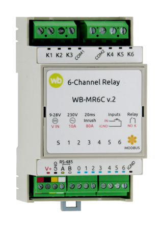
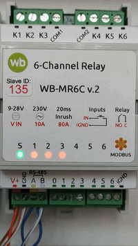
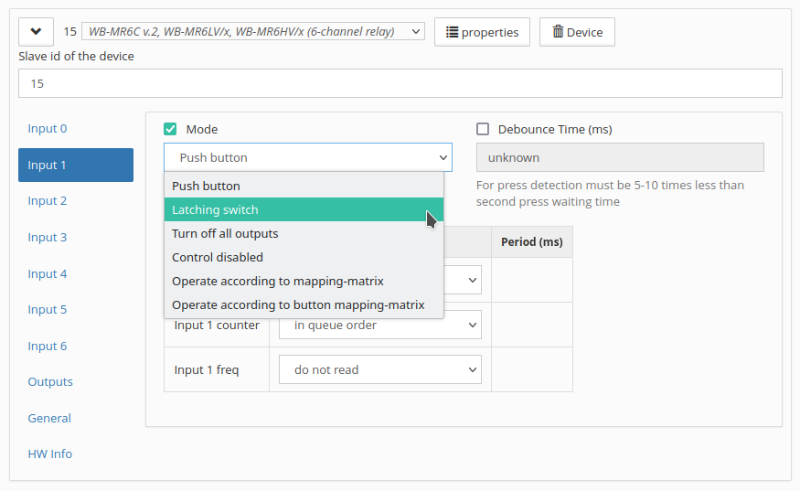
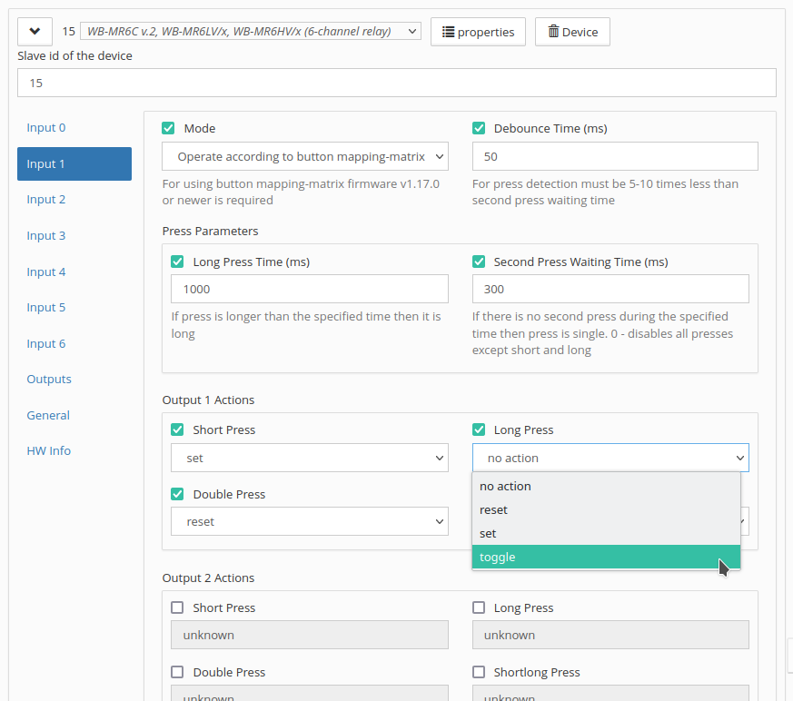
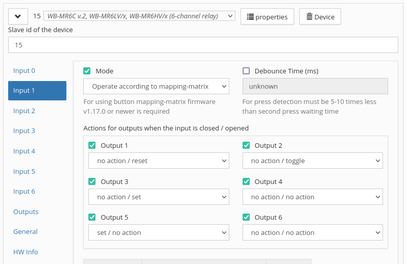
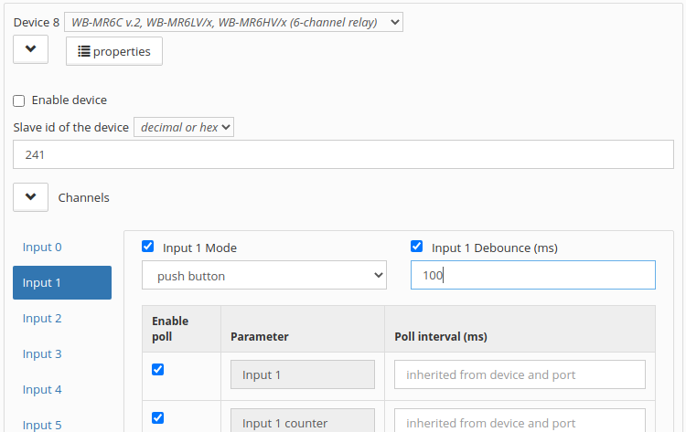
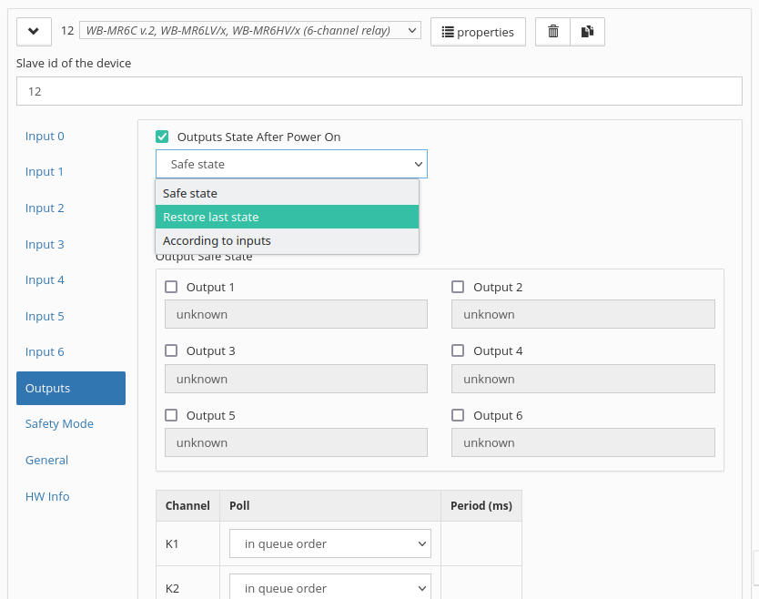
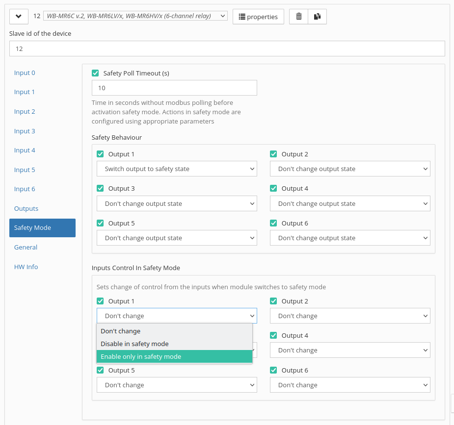
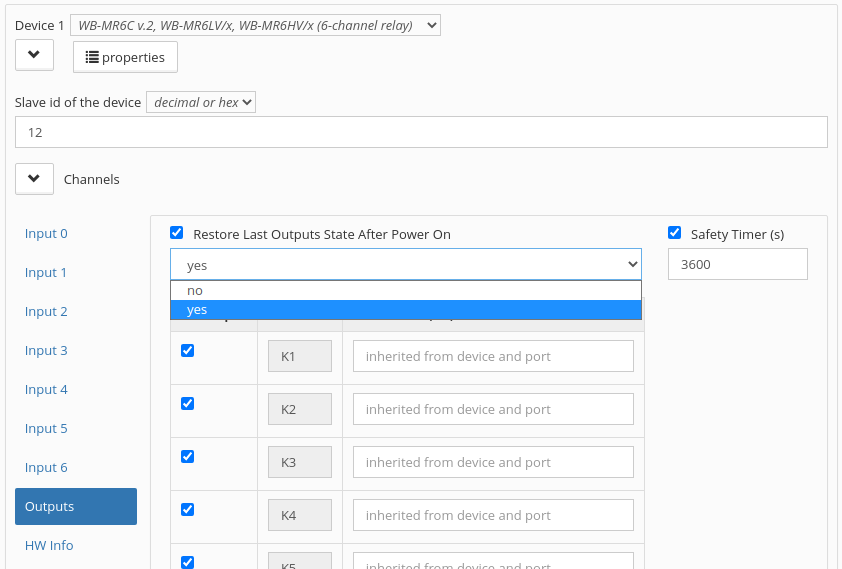

# Модуль реле WB-MR6C v.2

{ width="300" align=right}

## Описание

Шестиканальные модули реле WB-MR6C v.2 выпускаются для систем промышленной и домашней автоматизации и предназначены для прямого управления светодиодными, люминесцентными светильниками, лампами накаливания и другими нагрузками номиналом до 10 А (2 кВт). Также могут использоваться как модули ввода-вывода общего назначения.

Благодаря специальной конструкции реле, каждый канал может выдерживать длительный ток до 16 А и пусковые токи до 80 А. Обратите внимание, что из-за конструкции клеммников, суммарный номинальный коммутируемый ток на группу из трёх каналов 20 А.

??? note "Технические характеристики"

    Питание

    | Параметр                                                                       | Значение                                                                                                                                                                                                                                                             |
    |--------------------------------------------------------------------------------|----------------------------------------------------------------------------------------------------------------------------------------------------------------------------------------------------------------------------------------------------------------------|
    | Напряжение питания                                                             | 9 – 28 В постоянного тока                                                                                                                                                                                                                                            |
    | Потребляемая мощность                                                          |   В режиме холостого хода (со всеми выключенными реле) — 0.1 Вт   Со всеми включенными реле — 1 Вт   Пиковое значение — до 4 Вт в течение 20 мс                                                                                                                      |

    Выходы

    | Параметр                                                                       | Значение                                                                                                                                                                                                                                                             |
    |--------------------------------------------------------------------------------|----------------------------------------------------------------------------------------------------------------------------------------------------------------------------------------------------------------------------------------------------------------------|
    | Количество выходов                                                             | 6                                                                                                                                                                                                                                                                    |
    | Тип выходов                                                                    | Контакты механического реле                                                                                                                                                                                                                                          |
    | Конфигурация контактов                                                         | Двухпозиционные, нормально открытые                                                                                                                                                                                                                                  |
    | Конфигурация выходов                                                           | Две группы по 3 выхода, общий провод в каждой группе                                                                                                                                                                                                                 |
    | Максимальное коммутируемое напряжение, AC                                      | 250 В                                                                                                                                                                                                                                                                |
    | Максимальное коммутируемое напряжение, DC                                      | 30 В                                                                                                                                                                                                                                                                 |
    | Номинальный коммутируемый ток на каждый канал, 230 В (AC)                      | 10 А                                                                                                                                                                                                                                                                 |
    | Максимальный коммутируемый ток на каждый канал, 230 В (AC)                     | 16 А                                                                                                                                                                                                                                                                 |
    | Максимальный пусковой ток (в течение 20 мс), 230 В (AC)                        | 80 А                                                                                                                                                                                                                                                                 |
    | Суммарный номинальный коммутируемый ток на группу из трёх каналов, 230 В (AC)  | 20 А                                                                                                                                                                                                                                                                 |
    | Сопротивление контактов                                                        | < 100 мОм                                                                                                                                                                                                                                                            |
    | Напряжение изоляции между контроллером и выходом                               | 1500 В (среднеквадратичное значение)                                                                                                                                                                                                                                 |
    | Срок жизни                                                                     | 100 000 переключений для нагрузки 10 А / 230 В переменного тока                                                                                                                                                                                                      |
    | Подробные характеристики                                                       | Hongfa HF32FV-16                                                                                                                                                                                                                                                     |

    Входы

    | Параметр                                                                       | Значение                                                                                                                                                                                                                                                             |
    |--------------------------------------------------------------------------------|----------------------------------------------------------------------------------------------------------------------------------------------------------------------------------------------------------------------------------------------------------------------|
    | Количество входов (Inputs 0—6)                                                 | 7 (6+1) Вход 0 отключает одновременно все реле (можно настроить по-другому)                                                                                                                                                                                          |
    | Тип входов                                                                     | «Сухой контакт», групповая изоляция  Напряжение на входе ~12 В.  Ток при замыкании входа ~2 мА                                                                                                                                                                       |
    | Допустимое напряжение                                                          | от -20 В до +40 В                                                                                                                                                                                                                                                    |
    | Частота и длительность импульсов                                               |   До 10 Гц (T > 50 мс) - по умолчанию   До 1 кГц при уменьшении времени защиты от дребезга   До 5 кГц (с версии прошивки 1.15.0)   (смотри таблицу ревизий)                                                                                                          |
    | Функции                                                                        |   Входы общего назначения   Счет сигналов   Измерение частоты (с версии прошивки 1.15.0)   Прямое управление каналами реле   Одновременное отключение всей нагрузки   Гибкая настройка взаимодействия с реле   с помощью mapping-матрицы (с версии прошивки 1.9.0)   |

    Индикация

    | Параметр                                                                       | Значение                                                                                                                                                                                                                                                             |
    |--------------------------------------------------------------------------------|----------------------------------------------------------------------------------------------------------------------------------------------------------------------------------------------------------------------------------------------------------------------|
    | Индикация питания и обмена данными                                             | Зеленый светодиод Status (под верхней этикеткой)                                                                                                                                                                                                                     |
    | Индикация состояния каналов реле                                               | Оранжевые светодиоды 1, 2.. (под верхней этикеткой)                                                                                                                                                                                                                  |

    Управление

    | Параметр                                                                       | Значение                                                                                                                                                                                                                                                             |
    |--------------------------------------------------------------------------------|----------------------------------------------------------------------------------------------------------------------------------------------------------------------------------------------------------------------------------------------------------------------|
    | Интерфейс управления                                                           | RS-485                                                                                                                                                                                                                                                               |
    | Изоляция интерфейса                                                            | Неизолированный                                                                                                                                                                                                                                                      |
    | Протокол обмена данными                                                        | Modbus RTU, адрес задается программно, заводские настройки указаны на наклейке                                                                                                                                                                                       |
    | Параметры интерфейса RS-485                                                    | Задаются программно, по умолчанию:  скорость — 9600 бит/с; данные — 8 бит; бит чётности — нет (N); стоп-биты — 2                                                                                                                                                     |
    | Готовность к работе после подачи питания                                       | ~2 c                                                                                                                                                                                                                                                                 |

    Условия эксплуатации

    | Параметр                                                                       | Значение                                                                                                                                                                                                                                                             |
    |--------------------------------------------------------------------------------|----------------------------------------------------------------------------------------------------------------------------------------------------------------------------------------------------------------------------------------------------------------------|
    | Температура воздуха                                                            | От −40 до +80 °С                                                                                                                                                                                                                                                     |
    | Относительная влажность                                                        | До 95 %, без конденсации влаги                                                                                                                                                                                                                                       |
    | Климатическое исполнение по ГОСТ 15150-69                                      |  O2.1*                                                                                                                                                                                                                                                               |
    | Гарантийный срок                                                               | 2 года                                                                                                                                                                                                                                                               |
    | Срок службы                                                                    | 5 лет                                                                                                                                                                                                                                                                |

    Клеммники и сечение проводов

    | Параметр                                                                       | Значение                                                                                                                                                                                                                                                             |
    |--------------------------------------------------------------------------------|----------------------------------------------------------------------------------------------------------------------------------------------------------------------------------------------------------------------------------------------------------------------|
    | Рекомендуемое сечение провода с НШВИ                                           | для входов управления: 0.35 – 1 мм2 — одинарные, 0.35 – 0.5 мм2 — сдвоенные провода,  для силовых входов:  до 2.5 мм2 — одинарные, до 1.5 мм2 — сдвоенные провода                                                                                                    |
    | Длина стандартной втулки НШВИ                                                  | 8 мм                                                                                                                                                                                                                                                                 |
    | Момент затяжки винтов                                                          | для входов управления: 0.2 Н∙м, для силовых выходов: 0.5 Н∙м                                                                                                                                                                                                         |

    Габариты

    | Параметр                                                                       | Значение                                                                                                                                                                                                                                                             |
    |--------------------------------------------------------------------------------|----------------------------------------------------------------------------------------------------------------------------------------------------------------------------------------------------------------------------------------------------------------------|
    | Ширина, DIN-юнитов                                                             | 3                                                                                                                                                                                                                                                                    |
    | Габаритные размеры (Д x Ш x В)                                                 | 53 x 90 x 58 мм                                                                                                                                                                                                                                                      |
    | Масса (с коробкой)                                                             | 155 г                                                                                                                                                                                                                                                                |

## Общий принцип работы

### Индикация
В модуле есть индикаторы, которые помогут определить его состояние без подключения к контроллеру:

- S — статус обмена по Modbus: загорается при подаче низковольтного питания на модуль и мигает в момент опроса по шине RS-485. В режиме загрузчика редко мигает. При загрузке новой прошивки перестает менять свое состояние.
- 1–6 — состояние выходов: горит — реле замкнуто.

??? info "Анимация"
    

### Входы

Входы реле выведены на разъёмные клеммники с номерами и общей клеммой iGND, работают по принципу «Сухой контакт».

=== "fw ≥ 1.15.0"

    К входам можно подключить выключатели для прямого управления выходами, или источник сигнала и посчитать количество импульсов, а также измерить его частоту.

    Максимальное значение измеряемой частоты сигнала зависит от ревизии устройства и от количества измеряемых сигналов. На испытании мы успешно измеряли шесть сигналов одновременно на частоте 2.5 кГц.

=== "fw < 1.15.0"

    К входам можно подключить выключатели для прямого управления выходами, или источник сигнала и посчитать количество импульсов.

    Выключатели можно использовать с фиксацией и без неё. При использовании выключателей без фиксации доступно распознавание нескольких типов нажатий, на которые можно назначить свои действия — это полезно для создания сценарных выключателей.

    Также эти нажатия транслируются на контроллер по Modbus, где вы можете обрабатывать их программно. В ПО контроллера Wiren Board счётчики нажатий по умолчанию не опрашиваются, если они вам нужны — включите их опрос в настройках устройства.

По умолчанию каждый вход управляет выходом с таким же номером, а вход с номером «0» отключает все выходы.

=== "fw ≥ 1.12.0"

    По умолчанию модуль настроен на выключатели с фиксацией — состояние контактов реле повторяют состояние контактов выключателя.

=== "fw < 1.12.0"

    По умолчанию модуль настроен на работу с выключателями без фиксации — каждое замыкание входа меняло состояние реле на противоположное.

Тип выключателей и настройки входов можно изменить в настройках.

### Распознавание типов нажатий

=== "fw ≥ 1.17.0"

    Модуль может распознавать четыре типа нажатий: короткое, длинное, двойное, короткое, а затем длинное.

    Обработку нажатий можно использовать на контроллере, куда по Modbus передаются специальные счётчики для каждого типа нажатий, или в самом устройстве для управления выходами.

    Параметры распознавания нажатий можно изменять в настройках.

=== "fw < 1.17.0"

    Не поддерживается.

### Выходы

Внутри установлены 6 реле Hongfa HF32FV-16 с нормально открытыми контактами. Выходы объединены в две группы, каждая со своим общим проводом: COM1 и COM2. На выходы COM1 и COM2 можно подключить разные фазы. Допустимую мощность и тип коммутируемой нагрузки смотреть в статье Рекомендации по выбору реле.

??? info "Схема контактов реле"
    

С прошивки 1.18.4 можно настроить безопасное состояние каждого выхода выбрать поведение выходов при включении реле.

## Монтаж



## Подключение к контроллеру Wiren Board

### Выбор шаблона



- в текущем релизе — WB-MR6C v.2, WB-MR6LV/x, WB-MR6HV/x,
- в старых версиях ПО — WB-MR6C.

### Управление устройством и просмотр значений



С помощью виртуальных выключателей K 1­ — K 6 можно управлять выходами модуля и следить за их состоянием. Если реле будет выключено или включено через внешний вход — это отразится в веб-интерфейсе.

Переключатели Input 1 ­— Input 6 показывают текущее состояние входов реле и недоступны для изменения.

Счетчики нажатий/включений отображаются в полях Input 1 counter­ — Input 6 counter. Значения счетчиков хранятся в оперативной памяти микроконтроллера реле и обнуляются при сбросе питания.

О восстановлении состояния реле после перебоя питания описано в разделе _Режим работы реле при возобновлении питания_.

## Настройка

### Режимы работы входов

По умолчанию входы модуля управляют выходами с такими же номерами, а нулевой вход отключает все выходы одновременно.

В параметре **Режим работы** вы можете выбрать тип выключателя, отключить реакцию на нажатия или задать сложную логику через Mapping-матрицу.

При отключении реакции на срабатывание входов вы всё равно сможете передать состояния и счётчики на контроллер для использования в сценариях автоматизации.

### Управление с выключателей

При выборе режима mapping-матрицы для кнопок, вы сможете настроить действия с выходами для каждого их четырёх типов нажатий, что позволит делать сценарные и проходные выключатели. Как это работает, смотрите в разделе Распознавание типов нажатий.

Доступны настройки:

- Время длинного нажатия (мс) — время в мс, которое разделяет длинные и короткие нажатия. Если нажатие длится больше указанного времени, оно считается длинным, иначе — коротким.
- Время ожидания второго нажатия (мс) — время в мс, которое создает «окно» указанной длительности после завершения короткого нажатия. Если второе нажатие попадет в это окно, нажатие будет считаться двойным, иначе — одиночным.
- Время подавления дребезга (мс) — время в мс, в течение которого сигнал на входном клеммнике должен иметь неизменный уровень, после чего он будет зафиксирован и обработан алгоритмом распознавания нажатий. При работе с нажатиями, значение должно быть в 5-10 раз меньше, чем время ожидания второго нажатия.
- Период опроса для каждого счётчика — чтобы обрабатывать нажатия программно на контроллере, включите опрос нужных счётчиков и настройте период опроса по инструкции.

Детектирование двойных вносит задержку на детектирование одиночных. Например, при настройке по умолчанию (300 мс) событие одиночного нажатия произойдет через 300 мс после отпускания кнопки. Если вам не нужны двойные и короткие, а затем длинные нажатия, то Время ожидания двойного нажатия нужно установить на 0 мс. Тогда событие одиночного нажатия произойдет сразу после отпускания кнопки.

Распознавание нажатий выполняется после подавления дребезга. Это означает, что при настройке Время подавления дребезга по умолчанию (50 мс) любые нажатия длительностью менее 50 мс будут игнорироваться. Точно так же это влияет на скорость реакции при отпускании кнопки: отпускание будет зафиксировано через 50 мс после фактического отпускания кнопки. Время подавления дребезга следует подбирать к конкретной кнопке таким образом, чтобы вносимая задержка была минимальной, но не было ложных срабатываний, например, двойное нажатие вместо одиночного.

Настройки входов по умолчанию:
- каждый вход управляет соответствующим реле, т.е. вход номер 2 управляет реле номер 2;
- режим работы для входов — выключатель с фиксацией;
- нулевой вход отключает все реле.

??? note "Видео: Обработка нажатий в устройствах Wiren Board"

    

### Управление по mapping-матрице

Классическая mapping-матрица позволяет назначать дейтсвия с выходом на фронты сигнала на входе модуля.

### Антидребезг
Для любого из входов реле вы можете настроить фильтр антидребезга в параметре Время подавления дребезга (мс). Возможные значения от 0 до 250 мс (от 0 до 100 в прошивках до 1.17.8), значение по умолчанию — 50 мс.

### Состояния выходов при подаче питания

Вы можете настроить поведение устройства при подаче питания:

- Перевести выход в безопасное состояние — для каждого выхода состояние выбирается пользователем в параметре Состояния реле при подаче питания.
- Восстановить последнее состояние — если каналы реле до обесточивания были включены, то после подачи питания они так же включатся.
- Состояние соответствующее состоянию входов — при старте модуль установит выходы в состояние по формуле: Вход N замкнут → Выход N включён, где N — номер входа/выхода. Работает только, если вход в режиме «Выключатель с фиксацией».

### Безопасный режим
Безопасный режим позволяет остановить технологические процессы в случае, если контроль над модулем утрачен, например, перебит кабель RS-485. Рекомендуем учитывать возможность потери связи с контроллером при проектировании систем управления.

Таймер безопасного режима начинает отсчёт после каждого успешно обработанного (принятого) пакета Modbus и при достижении установленного времени — реле переходит в безопасный режим. При возобновлении связи, реле вернётся к обычной работе. По умолчанию таймер установлен в значение 10 секунд.

Для каждого выхода можно настроить безопасное состояние и необходимость перехода в него в случае потери связи.

Можно настроить поведение управления с входов:

- Не блокировать — если было разрешено управление с входов, то оно сохраняется.
- Блокировать в безопасном режиме — управлять реле с входов будет нельзя.
- Разрешить только в безопасном режиме — если управление с входов было заблокировано в настройках, в безопасном режиме реле можно будет управлять.

Во всех случаях настройки mapping-матриц игнорируются.

??? note "Видео: Безопасный режим в модулях реле Wiren Board"

    

## Работа по Modbus



## Обновление прошивки



=== "fw ≥ 1.19.0"

    При использовании загрузчика версии не ниже 1.2.х настройки хранящиеся в памяти модуля не пропадают при обновлении прошивки.

=== "fw < 1.19.0"

    При обновлении прошивки настройки из памяти модуля будут стёрты. Чтобы не терять настройки — обновите прошивку и загрузчик.

## Известные неисправности

## Ревизии

## Изображения и чертежи
