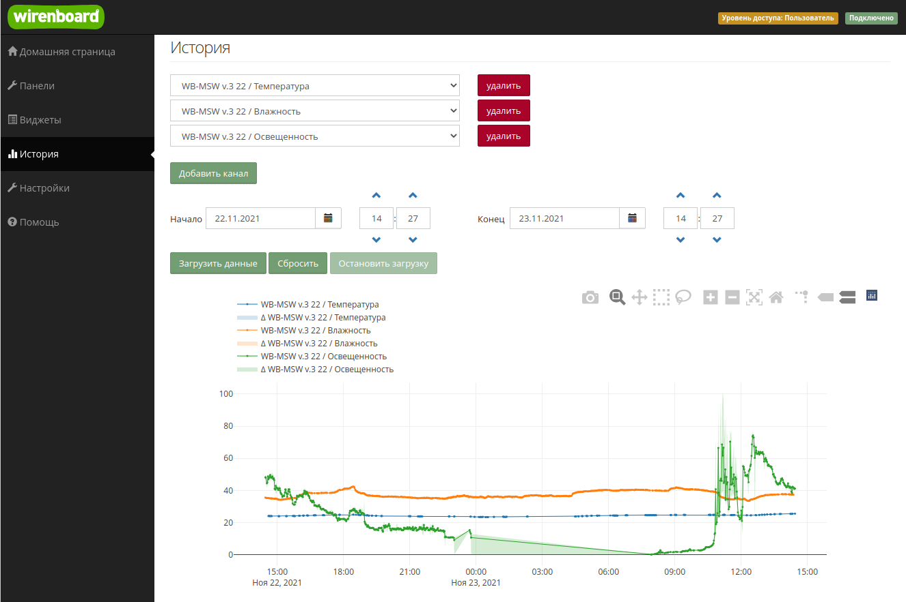

# wb-mqtt-homeui

## Общие сведения

Программное обеспечение для контроллеров Wiren Board основано на свободной операционной системе Debian Linux и состоит из набора дополнительных пакетов, с помощью которых можно решить большинство задач автоматизации.

ПО является неотъемлемой частью контроллера Wiren Board, поэтому пользователь не устанавливает его, а взаимодействует с ним через пользовательский интерфейс.

Для конечного пользователя разработан веб-интерфейс, который позволяет настраивать и эксплуатировать контроллер, а также обновлять программное обеспечение, писать скрипты автоматизации и просматривать архив данных.

Для продвинутых пользователей доступна текстовая консоль контроллера, доступ к которой можно получить через SSH.

Контроллер Wiren Board

## Доступ к веб-интерфейсу

Веб-интерфейс предустановлен на все контроллеры Wiren Board с завода и для доступа к нему нужно знать ip-адрес контроллера, который необходимо ввести в адресной строке современного браузера. Рекомендуем использовать браузеры Mozilla FireFox и Яндекс.Браузер.

Веб-интерфейс контроллера в браузере Firefox

## Смена прав доступа

В контроллере предусмотрены три роли:

*   пользователь — может просматривать панели и историю;
*   оператор — может создавать и редактировать панели;
*   и администратор — имеет полный доступ к настройкам и правилам.

Чтобы менять настройки, нужно выставить права доступа «Администратор».

Страница смены прав доступа

## Смена языка веб-интерфейса

Контроллер поддерживает русский и английский языки веб-интерфейса. Переводятся панели, меню и каналы устройств, если язык был задан разработчиком шаблона.

По умолчанию выбирается язык, установленный пользователем в браузере, через который открыт веб-интерфейс, но вы можете это изменить. Зайдите в раздел «Настройки» → «Веб-интерфейс» и выберите язык в разделе «Общие параметры».

Настройка языка

## SSH

SSH — это протокол, при помощи которого можно получить доступ к текстовой консоли Wiren Board через локальную сеть или Интернет.

Консоль контроллера — это инструмент администратора, который позволяет изменять системные настройки, обновлять программное обеспечение и устанавливать сторонние программы. Также по SSH можно загружать и скачивать файлы.

Контроль контроллера Wiren Board

Учетная запись по умолчанию: логин root, пароль wirenboard.

Рекомендуем после первого входа сменить пароль, для этого введите в консоли контроллера команду passwd и дважды введите новый пароль:

Подключиться по SSH можно несколькими способами:

1.  В Windows с помощью специальных программ, например, Putty.
2.  В Linux командой вида ssh root@192.168.42.1, где root — логин.

## Настройка контроллера

Контроллер — сложное устройство и для его настройки есть специальный конфигуратор, который позволяет настраивать:

*   сетевые интерфейсы контроллера;
*   параметры NTP-клиента;
*   подключённые к контроллеру модули расширения и ввода-вывода;
*   подключенное по RS-485 оборудование;
*   сервис подключения к устройствам KNX;
*   аналоговые и цифровые входы-выходы контроллера;
*   параметры архива данных;
*   шлюз Modbus TCP/RTU протоколов;
*   сервис SMS и email-оповещений.

Инструмент находится на вкладке «Настройки»→«Конфигурационные файлы» и доступен только в режиме администратора.

Перечень настроек

### Сетевые интерфейсы

В контроллере есть несколько сетевых интерфейсов: два Ethernet, Wi-Fi клиент и точка доступа, опционально 4G модем.

Все они настраиваются из веб-интерфейса контроллера в разделе «Настройки» →«Конфигурационные файлы» → «Сетевые соединения».

Так как интерфейсов много, то может понадобится задать приоритет их работы: если на одном интернет пропал, переключаемся автоматически на другой.

По умолчанию контроллер создаёт открытую Wi-Fi точку доступа, рекомендуем отключить её или включить шифрование и установить пароль.

Пример настройки сетевого интерфейса

### Установка времени

Контроллер Wiren Board с завода настроен на синхронизацию времени через интернет по протоколу NTP. Если у контроллера есть доступ в интернет и установлен верный часовой пояс, то настраивать ничего не нужно.

Пользователь может изменить адреса NTP серверов, для этого надо перейти в раздел «Настройки» →«Конфигурационные файлы» → «Синхронизация даты и времени (NTP)».

Пример настроек синхронизации времени

Если у контроллера нет доступа в интернет, а в вашей локальной сети нет сервера времени, время можно задать вручную:

1.  подключитесь к контроллеру по SSH;
2.  отключите автоматическую синхронизацию командой timedatectl set-ntp 0
3.  установите время командой timedatectl set-time '2020-10-12 01:58:00'
4.  синхронизируйте аппаратный таймер контроллера с новым временем командой hwclock --systohc --localtime

### Настройка аналоговых входов A1…A4

Входы A1…A4 универсальны и могут обрабатывать как дискретные сигналы, так и аналоговые. Кроме этого они могут работать в режиме выхода, режим выбирается в интерфейсе пользователя в разделе «Устройства».

Сами аналоговые входы настраиваются в разделе «Настройки» →«Конфигурационные файлы» → «Аналоговые входы».

### Настройка модулей расширения и портов

На борту контроллера есть множество портов ввода-вывода, которые можно настроить в разные режимы.

Кроме этого в контроллер можно устанавливать модули расширения и подключать боковые модули WBIO.

Всё это настраивается в веб-интерфейсе контроллера в разделе «Настройки» →«Конфигурационные файлы» → «Модули расширения и порты».

Аналоговые входы A1…A4 настраиваются отдельно.

Пример настройки модули WBIOModbus и другие устройства, подключенные к последовательному порту

В контроллере есть два физических последовательных порта RS-485, ещё три можно добавить модулями расширения. Также драйвер контроллера умеет работать с виртуальными сетевыми портами.

Перед настройкой параметров устройств, их надо добавить. Далее пользователь задаёт мышкой нужные параметры и сохраняет результат.

Пример настройки подключенного устройства

### KNX-устройства

К контроллеру можно подключать любые KNX-устройства: панели, реле, датчики, кнопки и т.п.

Пользователь может настроить групповые адреса вручную или загрузить проект из конфигуратора ETS.

Загрузка конфигурации ETS делается через консоль, для этого:

1.  Выгрузите проект из ETS.
2.  Загрузите его на контроллер.
3.  Выполните команду wb-knx-ets-tool ETS\_CONFIG /etc/wb-mqtt-knx.conf, где ETS\_CONFIG — пусть к выгруженному выше конфигу.

Пример настройки групповых адресов

## Создание интерфейса пользователя

Для управления контроллером Wiren Board и подключенными устройствами есть текстовые и графические панели управления.

Инструмент находится на вкладке «Панели» и доступен только в режиме администратора.

### Текстовая панель

Основной элемент текстовой информационной панели — виджет. Виджет позволяет вывести в одном месте информацию из разных источников.

Кроме показа информации виджет может содержать элементы управления: переключатели, кнопки и ползунки для выбора значения из диапазона. На этапе создания виджета вы задаете ему название, выбираете какие данные он будет отображать и как они будут называться. Количество виджетов на одной панели не ограничено.

Пример текстовой панели

### Интерактивная SVG-панель

SVG-панель — это интерактивная графическая панель. С помощью SVG-панелей можно создавать виртуальные пульты управления автоматикой объекта и мнемосхемы технологических установок.

Чтобы создать SVG-панель, нужно нарисовать в любом векторном графическом редакторе svg-изображение, загрузить его в ПО Wiren Board и привязать графические и текстовые элементы к источникам информации или элементам управления. Источниками информации могут быть любые MQTT-топики.

В веб-интерфейсе есть визуальный редактор, который упрощает процесс создания панели — выбираете элемент на svg-изображении и указываете какие данные в него выводить, как на них реагировать и что делать, если пользователь воздействовал на элемент.

Возможности:

*   вывод текстовой или логической информации;
*   изменение внешнего вида svg-элемента в зависимости от полученной информации: вы можете изменять цвет заливки и обводки, прозрачность элемента, а так же подменить полученное значение своим или скрыть/показать элемент;
*   воздействие на исполнительные механизмы: включение и выключение нагрузки, изменение режимов работы устройств.

Пример графической панели

## Скрипты автоматизации

Штатным инструментом автоматизации является собственный движок wb-rules, который позволяет составлять скрипты автоматизации на JS-подобном языке. Скрипты можно создавать и редактировать прямо в веб-интерфейсе, доступна отладка в консоли.

Возможности:

*   автоматизация любых действий с данными или подключенными устройствами;
*   чтение и публикация MQTT-топиков;
*   работа с таймерами;
*   работа с сервисами оповещений и предупреждений;
*   создание виртуальных устройств со своей логикой;
*   работа с файловой системой контроллера.

Инструмент находится на вкладке «Правила» и доступен только в режиме администратора.
Пример скрипта автоматизации в редакторе

## Просмотр архива данных

Вы можете анализировать изменение полученных контроллером данных во времени с помощью графиков. Источником архивных данных могут служить любые MQTT-топики и виджеты.

Возможности:

*   выбор временного периода;
*   одновременное отображение данных с нескольких источников;
*   автоматическая расцветка графиков разными цветами;
*   курсорные измерения на одном или нескольких графиках;
*   масштабирование графика и перемещение по нему;
*   просмотр дельты изменения значения;
*   снятие скриншотов.

Параметры архива настраиваются в разделе «Настройки» →«Конфигурационные файлы» → «История данных MQTT».

Пример просмотра архива значений

## Отправка данных в ПО верхнего уровня

Контроллер Wiren Board может выступать в роли шлюза и обмениваться данными с программным обеспечением верхнего уровня: ПО других устройств, SCADA-системы, облачные MQTT-брокеры.

### Шлюз Modbus RTU/TCP

Из веб-интерфейса можно настроить обмен данными с внешними устройствами и ПО по протоколам Modbus TCP и Modbus RTU. В этом случае контроллер будет выступать в роли Modbus Slave-устройства, а вы сможете не только считывать данные с контроллера, но и передавать команды подключенным к нему устройствам.

Настраивается шлюз в разделе «Настройки» →«Конфигурационные файлы» → «Шлюз MQTT - Modbus RTU/TCP slave».

Пример настройки шлюза в Modbus TCP

### Шлюз OPC UA

Контроллер может выступать в роли шлюза и отдавать данные в систему верхнего уровня по протоколу OPC UA.

Настраивается шлюз в разделе «Настройки» →«Конфигурационные файлы» → «Шлюз MQTT - OPC UA». Пользователю надо выбрать, какие каналы надо транслировать по этому протоколу, а также указать адрес и порт. Остальное происходит автоматически.

Пример настройки шлюза OPC UA

### Шлюз МЭК

Контроллер может выступать в роли шлюза и отдавать данные в систему верхнего уровня по протоколу МЭК 60870-5-104. Протокол популярен в энергетике.

Настраивается шлюз в разделе «Настройки» →«Конфигурационные файлы» → « Шлюз MQTT - МЭК 60870-5-104». Пользователю надо выбрать, какие каналы надо транслировать по этому протоколу, а также указать адрес и порт.

Пример настройки шлюза МЭК

## Просмотр системного журнала

В контроллерах Wiren Board используется системный сервис журналов journald, который обрабатывает события на запись в лог и сохраняет их в бинарные файлы. Если в процессе эксплуатации контроллера или подключённых устройств возникли ошибки — в первую очередь нужно посмотреть сообщения системного журнала.

В веб-интерфейсе сообщения системного журнала доступны с помощью инструмента «Системный журнал», который находится на вкладке «Настройки».

Возможности:

*   просмотр сообщений системного журнала;
*   фильтрация сообщений по сервисам;
*   экспорт загруженных сообщений в текстовый файл.

Просмотр системного журнала

## Обновление ПО

Так как программное обеспечение постоянно совершенствуется, есть встроенный инструмент для загрузки образов ПО в контроллер.

Инструмент обновления ПО находится в разделе «Настройки» →«Система».

Тут же можно настроить подключение к облаку, собрать данные для диагностики и сбросить контроллер к заводским настройкам.

Возможности раздела «Система»

Процесс обновления программного обеспечения через веб-интерфейс
